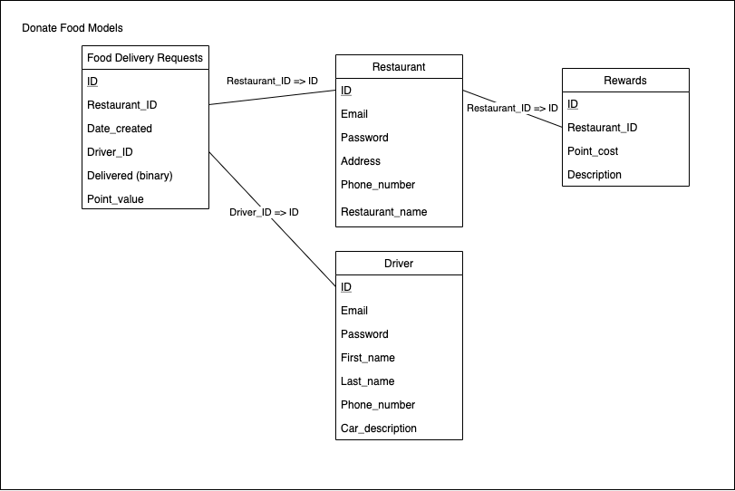

Original App Design Project - README Template
===

# Donate Food App

## Table of Contents
1. [Overview](#Overview)
1. [Product Spec](#Product-Spec)
1. [Wireframes](#Wireframes)
2. [Schema](#Schema)

## Overview
### Description
Restaurant will post picture/list of food, then app will calculate (3 closest) shelters and the driver will able to see distance from restaurant to shelter. Driver can choose the request and drive to the shelter of their choosing, upon completion the driver indicates that in the app and earns points. After earning enough points, Driver can use that at a participating restaurant for discounts to reward volunteering work. 

### App Evaluation
[Evaluation of your app across the following attributes]
- **Category:** Charity
- **Mobile:** Mobile App
- **Story:** Restaurants post food donation requests. Drivers accept and deliver to shelters.
- **Market:** Any restaurant that has an excess of food, shelters that need food, for volunteers who already do this but w/o the app. 
- **Habit:** Restaurant closing-times for them to post any excess food. 
- **Scope:** Fresh food needs to be delivered in a short amount of time so app needs to find closeby shelters, and drivers need directions to closeby shelters. This app can add location tracker and traveling time estimating feature.

## Product Spec

### 1. User Stories (Required and Optional)

**Required Must-have Stories**

Restaurants
* [x] create an account
* [x] login/logout

* [x] view profile

* [x] post a food donation request (progress)
* [x] table view of all the food donation requests

* [ ] can edit and remove food donation request
* [ ] can see driver profile who accepted request and ETA

Driver/Volunteer
* [x] create an account
* [x] login/logout
* [x] home screen

* [x] view profile

* [x] table view of all the food donation requests (and filter)
* [x] accept food donation request
* [ ] map with 3 closest shelters to restaurant

**Optional Nice-to-have Stories**

Restaurants
* [ ] can track the driver's journey to restaurant (ETA) and to the delivery-site
* [ ] location tracker
* [ ] status bar for driver and restaurant to see the progress of the mission

Driver/Volunteer
* [x] points system that tracks how many runs and a page where they can redeem it

### 2. Screen Archetypes

Restaurants
- Login
- Register
- Home Screen
- Add/Edit Item Screen
- Driver Profile Screen

Driver/Volunteer
- Login
- Register
- Home Screen
- Map Screen
- Accept Request Screen
- Restaurant Profile Screen

### 3. Navigation

**Tab Navigation** (Tab to Screen)

* Home Screen 
* Add Food donation request Screen
* Map Screen
* Accept Request Screen

**Flow Navigation** (Screen to Screen)
* Login -> Home Screen 
* Home Screen -> Add Food donation request Screen
* Home Screen -> Map Screen
* Map Screen -> Accept Request Screen

## Wireframes
[Add picture of your hand sketched wireframes in this section]

### [BONUS] Digital Wireframes & Mockups
Driver

<table><tr>
<td>  </td>
<td> 
 </td>
</tr></table>

Restaurant
<table><tr>
<td>  </td>
<td> </td>
</tr></table>

### [BONUS] Interactive Prototype
Driver's Side

Restaurant's Side

## Schema 
[This section will be completed in Unit 9]
### Models

### Networking
- Login Screen
	- (POST) Create/Send User Authentication
- Register Screen
	- (POST) Create new user/restaurant
- Restaurant Home Screen
	- (GET) Read Restaurant Data
- Restaurant's View of Driver Profile
	- (GET) Read Driver Data
- Add/Edit Pickup Request Screen
	- (POST) Create Food Delivery Request Object
	- (PUT) Update Food Delivery Request Object
- Add Reward Screen
	- (POST) Create new reward for restaurant
	- (PUT) Update reward for restaurant
- Restaurant's View of Restaurant Profile Screen
	- (GET) Read Restaurant Data
- Restaurant Edit Profile Screen
	- (PUT) Update Restaurant Profile
- Driver Home Screen
	- (GET) Read Driver Data
- Table View Screen
	- (GET) Read Food Delivery Requests
- Driver's View of Restaurant Profile
	- (GET) Read Restaurant Data
- Driver's View of Driver Profile
	- (GET) Read Restaurant Data
- Driver Edit Profile
	- (PUT) Update Driver Profile
- Accept Request
	- (PUT) Update Food Deliver Request to add Driver_ID

### Demo

